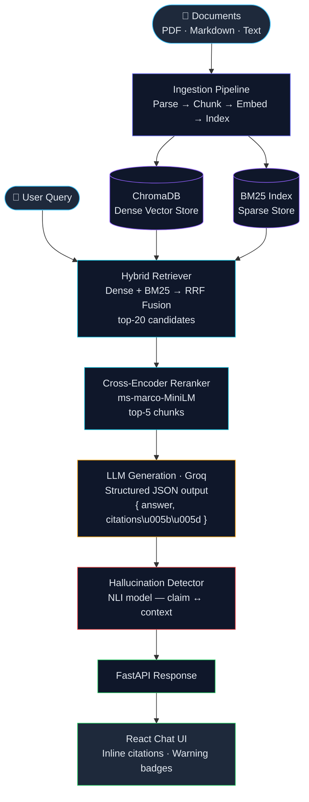

<div align="center">
  <h1>Ask My Docs</h1>
  <p>
    <strong>RAG with hybrid retrieval, citation-grounded generation, hallucination detection, and CI-gated evaluation.</strong>
  </p>
  <p>
    <a href="#features">Features</a> •
    <a href="#architecture">Architecture</a> •
    <a href="#quick-start">Quick Start</a> •
    <a href="#evaluation">Evaluation</a> •
    <a href="#tech-stack">Tech Stack</a>
  </p>
</div>

---

## Why This Project?

Most RAG projects are a thin LLM wrapper over a vector store. **Ask My Docs** goes further — it's designed around the patterns enterprise AI teams actually build:

- **Measurable retrieval quality** — ablation studies across chunking strategies and retrieval methods using RAGAS metrics.
- **Citation enforcement** — every answer is traceable to source documents via structured LLM output.
- **Hallucination safeguards** — automated claim-level verification against retrieved context.
- **Regression-gated CI** — evaluation pipelines that block deployments when quality degrades.

---

## Features

### 🔍 Hybrid Retrieval Pipeline
- **Dense retrieval** via sentence-transformer embeddings + ChromaDB
- **Sparse retrieval** via BM25 keyword search
- **Reciprocal Rank Fusion (RRF)** to combine both result sets
- **Cross-encoder reranking** (`ms-marco-MiniLM`) for precision-focused final selection

### 📄 Multi-Strategy Ingestion
- Supports **PDF**, **Markdown**, and **plain text** documents
- Three chunking strategies (benchmarked via ablation):
  - Fixed-size chunking (512 tokens, configurable overlap)
  - Semantic chunking (topic-shift detection via embedding similarity)
  - Sentence-window chunking (small chunks + surrounding context window)
- Preserves page/section metadata for downstream citation

### 📌 Citation-Grounded Generation
- LLM returns structured JSON output with `answer` + `citations[]`
- Each citation maps to a specific source document, page number, and chunk
- Enforced via function calling / JSON schema constraints — not regex parsing

### 🛡️ Hallucination Detection
- Post-generation claim-level verification using NLI model / LLM-as-judge
- Each sentence in the answer is checked against its cited context
- Unsupported claims are flagged with a visual warning in the UI

### 📊 RAGAS Evaluation Framework
- 100-sample golden Q&A benchmark with expected source chunks
- Automated metrics: **Faithfulness**, **Answer Relevance**, **Context Precision**, **Context Recall**
- Ablation experiments comparing:
  - Chunking strategies (fixed vs semantic vs sentence-window)
  - Retrieval strategies (dense-only vs BM25-only vs hybrid vs hybrid+rerank)
- Historical tracking of metrics across pipeline versions

### 🚦 CI-Gated Quality Pipeline
- GitHub Actions workflow on every push/PR
- Runs full RAGAS evaluation against the golden test set
- Compares against last known-good baseline (JSON artifact)
- **Fails the build** if any metric degrades beyond threshold (e.g. faithfulness Δ > 2%)
- Posts metric diff table as a PR comment

### 💬 React Chat UI
- Document upload and corpus management
- Chat interface with inline citation highlighting (hover for source details)
- Confidence/hallucination warning indicators per answer
- **Eval Dashboard** tab with metric trend charts and ablation comparison tables

---

## Architecture



---

## Project Structure

```
ask-my-docs/
├── backend/
│   ├── app/
│   │   ├── main.py                 # FastAPI application entry point
│   │   ├── config.py               # Configuration management
│   │   ├── models/                 # Pydantic schemas
│   │   │   ├── request.py
│   │   │   └── response.py
│   │   ├── ingestion/
│   │   │   ├── parser.py           # PDF / Markdown / text parsing
│   │   │   ├── chunker.py          # Chunking strategies
│   │   │   └── indexer.py          # Embedding + ChromaDB + BM25 indexing
│   │   ├── retrieval/
│   │   │   ├── dense.py            # Dense (embedding) retriever
│   │   │   ├── sparse.py           # BM25 retriever
│   │   │   ├── hybrid.py           # RRF fusion logic
│   │   │   └── reranker.py         # Cross-encoder reranking
│   │   ├── generation/
│   │   │   ├── generator.py        # LLM generation with structured output
│   │   │   └── prompts.py          # Prompt templates
│   │   ├── hallucination/
│   │   │   └── detector.py         # Claim-level hallucination checks
│   │   └── api/
│   │       ├── routes_query.py     # /query endpoint
│   │       ├── routes_ingest.py    # /ingest endpoint
│   │       └── routes_eval.py      # /eval endpoint
│   ├── evaluation/
│   │   ├── golden_qa.json          # 100-sample benchmark dataset
│   │   ├── evaluate.py             # RAGAS evaluation runner
│   │   ├── ablation.py             # Ablation experiment runner
│   │   └── baselines/
│   │       └── baseline.json       # Last known-good metric scores
│   ├── tests/
│   │   ├── test_ingestion.py
│   │   ├── test_retrieval.py
│   │   ├── test_generation.py
│   │   └── test_hallucination.py
│   ├── requirements.txt
│   └── Dockerfile
├── frontend/
│   ├── src/
│   │   ├── App.jsx
│   │   ├── components/
│   │   │   ├── ChatInterface.jsx
│   │   │   ├── CitationHighlight.jsx
│   │   │   ├── DocumentUpload.jsx
│   │   │   ├── EvalDashboard.jsx
│   │   │   └── HallucinationBadge.jsx
│   │   └── pages/
│   │       ├── ChatPage.jsx
│   │       └── EvalPage.jsx
│   ├── package.json
│   └── Dockerfile
├── .github/
│   └── workflows/
│       └── eval-ci.yml             # CI-gated evaluation workflow
├── docker-compose.yml
├── .env.example
└── README.md
```

---

## Quick Start

### Prerequisites
- Python 3.11+
- Node.js 18+
- Docker & Docker Compose (optional, for containerized setup)
- [Groq API key](https://console.groq.com) (free tier, no credit card required)

### Option 1: Docker Compose (Recommended)

```bash
# Clone the repository
git clone https://github.com/Revanthkolla16/Ask-my-Docs.git
cd ask-my-docs

# Configure environment
cp .env.example .env
# Edit .env with your API keys

# Start all services
docker-compose up --build
```

The app will be available at:
- **Frontend:** http://localhost:3000
- **Backend API:** http://localhost:8000
- **API Docs:** http://localhost:8000/docs

### Option 2: Local Development

```bash
# Backend
cd backend
python -m venv venv
source venv/bin/activate   # Windows: venv\Scripts\activate
pip install -r requirements.txt
uvicorn app.main:app --reload --port 8000

# Frontend (in a separate terminal)
cd frontend
npm install
npm run dev
```

### Ingest Documents

```bash
# Via API
curl -X POST http://localhost:8000/ingest \
  -F "files=@path/to/document.pdf" \
  -F "chunking_strategy=semantic"

# Or use the Upload UI at http://localhost:3000
```

### Ask a Question

```bash
curl -X POST http://localhost:8000/query \
  -H "Content-Type: application/json" \
  -d '{"question": "What are the key findings in the Q3 report?"}'
```

Response:
```json
{
  "answer": "The Q3 report highlights three key findings...",
  "citations": [
    {
      "chunk_id": "doc1_chunk_14",
      "document": "Q3_Report.pdf",
      "page": 7,
      "text_snippet": "Three primary findings emerged from..."
    }
  ],
  "hallucination_flags": [],
  "confidence": 0.94
}
```

---

## Evaluation

### Run RAGAS Evaluation

```bash
cd backend
python -m evaluation.evaluate --config configs/default.yaml
```

### Run Ablation Studies

```bash
# Compare chunking strategies
python -m evaluation.ablation --experiment chunking

# Compare retrieval strategies
python -m evaluation.ablation --experiment retrieval
```

### Sample Results

| Configuration | Faithfulness | Answer Relevance | Context Precision | Context Recall |
|---|:---:|:---:|:---:|:---:|
| Dense-only, fixed-512 | 0.82 | 0.79 | 0.71 | 0.68 |
| Hybrid (RRF), fixed-512 | 0.85 | 0.82 | 0.78 | 0.75 |
| Hybrid + Rerank, semantic | **0.91** | **0.88** | **0.85** | **0.82** |

> **Note:** Fill in actual results after running evaluations on your corpus.

### CI-Gated Pipeline

The GitHub Actions workflow (`.github/workflows/eval-ci.yml`) runs automatically on every push and pull request:

1. Executes the full RAGAS evaluation suite against the 100-sample golden test set.
2. Compares results against `evaluation/baselines/baseline.json`.
3. **Fails the build** if any metric degrades beyond the configured threshold.
4. Posts a metric diff table as a comment on the PR.

---

## Tech Stack

| Layer | Technology |
|---|---|
| Backend / Orchestration | Python, LangChain |
| Vector Store | ChromaDB |
| Sparse Retrieval | rank_bm25 |
| Reranking | Cross-encoder (`ms-marco-MiniLM-L-6-v2`) |
| Embeddings | `all-MiniLM-L6-v2` (sentence-transformers) |
| Evaluation | RAGAS |
| LLM | Groq (`llama-3.1-70b-versatile`) |
| API Layer | FastAPI |
| Frontend | React (Vite) |
| CI/CD | GitHub Actions |
| Containerization | Docker, Docker Compose |

---

## Configuration

All configuration is managed via environment variables (`.env`) and YAML config files:

```bash
# .env.example
LLM_PROVIDER=groq
LLM_API_KEY=your-groq-api-key-here
LLM_MODEL=llama-3.1-70b-versatile
EMBEDDING_MODEL=all-MiniLM-L6-v2
RERANKER_MODEL=cross-encoder/ms-marco-MiniLM-L-6-v2
CHROMA_PERSIST_DIR=./data/chroma
DEFAULT_CHUNKING=semantic                # fixed | semantic | sentence_window
CHUNK_SIZE=512
CHUNK_OVERLAP=50
RETRIEVAL_TOP_K=20
RERANK_TOP_N=5
HALLUCINATION_THRESHOLD=0.7
EVAL_REGRESSION_THRESHOLD=0.02
```

---

## Milestones

- [ ] **M1:** Ingestion + indexing — parse documents, chunking strategies, dense + sparse indexes
- [ ] **M2:** Hybrid retrieval + reranking — RRF fusion, cross-encoder, retrieval quality verification
- [ ] **M3:** Citation-grounded generation — structured LLM output with citations, chat API E2E
- [ ] **M4:** Hallucination detection — claim-checking against retrieved context
- [ ] **M5:** Evaluation harness — golden Q&A set, RAGAS integration, ablation studies
- [ ] **M6:** CI-gated pipeline — GitHub Actions with regression gating
- [ ] **M7:** Frontend — chat UI with citation highlighting + eval dashboard
- [ ] **M8:** Polish — Docker Compose, README finalization, demo recording

---

## License

MIT

---

## Acknowledgments

- [RAGAS](https://github.com/explodinggradients/ragas) — RAG evaluation framework
- [LangChain](https://github.com/langchain-ai/langchain) — LLM orchestration
- [ChromaDB](https://github.com/chroma-core/chroma) — vector store
- [sentence-transformers](https://github.com/UKPLab/sentence-transformers) — embedding and reranking models